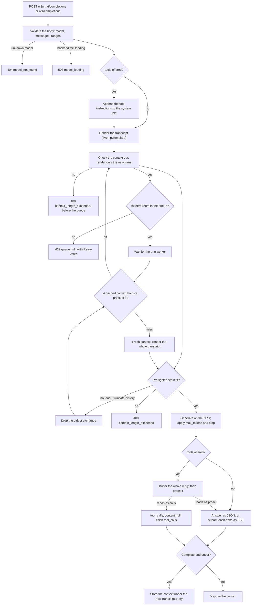
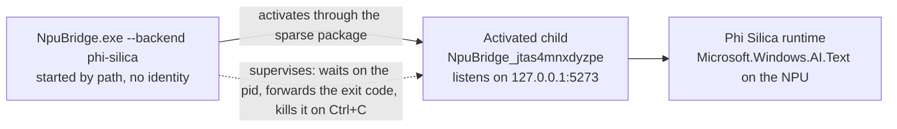

# npu-bridge

An OpenAI-compatible HTTP endpoint for the on-device language model on a Copilot+ PC (Snapdragon ARM64
NPU). Point OpenCode, Hermes, `curl` or the Python `openai` client at `http://127.0.0.1:5273/v1` and
use the NPU model as a provider: local, offline, free. `docs/CLIENTS.md` has the exact settings for
each of those four.

The model is small. Microsoft describes Phi Silica with a 4K-token context, and on a Snapdragon X
Elite an empty context accepts 3,581 tokens of prompt, roughly 13,400 characters of English, then
decodes at about 27 tokens per second. Those counts are the model's own: the bridge tokenizes with
Phi-3.5-mini's vocabulary, having measured that the runtime's prompt-length limit agrees with it.
Short conversations work well, and a continuing one is cheap because the bridge keeps the model's
context between turns. Long agent loops with a dozen tools will not fit: a real terminal agent's toolset alone measured
nearly three times the whole window, and its whole fixed prompt three to seven times. The bridge
answers with OpenAI's `context_length_exceeded` error instead of dropping turns on its own, and it
answers before the request can reach the model.

## Backends

| Backend | API | State |
|---|---|---|
| `phi-silica` | `Microsoft.Windows.AI.Text` (Windows App SDK) | works; every claim below was measured on it |
| `fake` | in-process, deterministic | for tests and dry runs |
| `aion` | `AionInstructPreview.Text` (Aion 1.0 Instruct preview SDK) | adapter built and unit-tested, never run: on the current Insider build Windows will not let a plain process load the Qualcomm execution provider the SDK needs (`docs/DECISIONS.md` D70). `/healthz` reports the failure |

Aion 1.0 Instruct, Microsoft's Phi Silica replacement, ships in October and November 2026 as a model
swap behind the same `Microsoft.Windows.AI.Text` API, so the `phi-silica` backend is the path that will
serve it. The preview SDK adapter is a stopgap. Aion 1.0 Plan, the 14B reasoning model with a 32K
window and native tool calling, is a separate model with no SDK yet; a GitHub issue tracks it until
one exists.

## Requirements

- Windows 11 24H2 or newer on an ARM64 Copilot+ PC. Both model frameworks are ARM64-only.
- .NET 10 SDK: `winget install --id Microsoft.DotNet.SDK.10`
- Phi Silica also needs package identity and the experimental Windows App Runtime, both installed by
  `scripts/identity.ps1`. No Limited Access Feature token is needed on that channel.

The fake backend needs none of this, so it is the quickest way to see the API shape.

## Quick start

```powershell
git clone https://github.com/ookla-ariel-ride/npu-bridge.git
cd npu-bridge
dotnet build
dotnet test
```

Run the bridge on the fake backend, which needs no hardware:

```powershell
.\src\NpuBridge\bin\Debug\net10.0-windows10.0.26100.0\win-arm64\NpuBridge.exe --backend fake
```

From another terminal:

```powershell
curl.exe http://127.0.0.1:5273/v1/chat/completions `
  -H "Content-Type: application/json" `
  -d '{"model":"fake","messages":[{"role":"user","content":"Say hello."}]}'
```

Quote the body with single quotes as above. The `-d "{\"...\"}"` form that works in `cmd` does not
survive PowerShell's argument passing, and the server answers `Request body is not valid JSON`.

### The real model

Register package identity once. This creates a self-signed certificate and installs the runtime
dependency, with one elevation prompt.

```powershell
.\scripts\identity.ps1 -Install
.\src\NpuBridge\bin\Debug\net10.0-windows10.0.26100.0\win-arm64\NpuBridge.exe --backend phi-silica
```

The first load takes up to about 25 seconds. Later starts take anywhere from under a second to
about 8 seconds, depending on whether the Windows runtime still holds the model. Watch for
`"status":"ready"` from `curl.exe http://127.0.0.1:5273/healthz`, then send the same request with
`"model":"phi-silica"`.

Any OpenAI client works against the same base URL:

```python
from openai import OpenAI

client = OpenAI(base_url="http://127.0.0.1:5273/v1", api_key="not-used")

reply = client.chat.completions.create(
    model="phi-silica",
    messages=[{"role": "user", "content": "What is a neural processing unit?"}],
)
print(reply.choices[0].message.content)
```

There is no authentication. The client library insists on a key, so pass anything. Add `stream=True`
and it streams over server-sent events like any other OpenAI provider. `docs/CLIENTS.md` covers
OpenCode and Hermes the same way, plus the wire-level traps a client author should know about before
relying on this bridge.

`scripts/smoke.ps1 -Backend phi-silica` checks the whole surface against the hardware in five to
ten minutes: health with identity, both response shapes, the cut, the context cache, the overflow
refusal and `--truncate-history` on a second server, the system-text guard with a 32,000-character
text whose token count is proved offline first, the tokenizer against the model's own prompt limit
and against the window the bridge reports, a tool-call probe over N runs (`-ToolProbeRuns`, five by default), two concurrent requests
queueing behind one another, a full queue answering 429 on a server started with capacity 1,
`/v1/completions` on both shapes, the port-in-use and identity failure paths, local configuration and
NPU_BRIDGE_* re-expression on a real start, the small model and embeddings routes, `--help` and
`--version`, the chat-path system-prompt and content-filter checks, and the once-only first-generation
RPC retry. It writes an optional UTF-8 JSON summary with `-JsonOut <path>`, then checks that the
relaunched child process exited and the port is free and prints the final generation health. It starts
and tears down five helper servers along the way, each with its own pass or fail row. Re-run
`identity.ps1 -Install` whenever the build output folder or the manifest changes, which includes moving
or renaming the clone.

## How a request travels



The system-text check comes first because it protects the machine: system text at or over the
model's window, or over 32,000 characters, is refused before any backend call and before a queue
slot is taken. Everything below the queue runs on one
worker. There is one model handle and no way to use it from
two requests at once, so a second request waits, and so do its cache lookup and its prompt-length
preflight, which are calls on that same handle. A request that arrives to a full queue is refused
with 429, code `queue_full`, and a `Retry-After` estimated from how long the last 16 generations have
averaged. The wait is why a streamed request can be refused inside the stream rather
than with a status code: by the time its turn comes, the first keep-alive comment may already have
gone out and fixed the response at 200.

The preflight is the runtime's own answer to "how much of this fits", asked before anything is
generated. Aion's preview SDK has no preflight, so on that backend the answer comes from the
generation's status instead, and with `--truncate-history` the bridge retries after it.

Buffering is what tool calling costs on the streaming path: nothing can tell a call from prose until
the model has stopped, so with `tools` present no token goes out until the whole reply is in hand.
Keep-alive comments hold the connection open while that happens.

## Endpoints

| Endpoint | Purpose |
|---|---|
| `POST /v1/chat/completions` | chat completions, streaming and non-streaming |
| `POST /v1/completions` | the legacy text-completion shape, streaming and non-streaming |
| `GET /healthz` | backend state, load time, package identity, context-cache and queue counters, streaming keep-alive timings, diagnostics, the backend's known context window in tokens (`context_window_tokens`, null when unknown), `last_generation`, and `consecutive_backend_faults`. Returns 200 while ready with fewer than two consecutive backend faults; returns 503 when loading, unavailable, or degraded |
| `GET /v1/models`, `GET /v1/models/{id}` | the active model id |
| `POST /debug/generate` | one literal prompt into the backend with timing. Diagnostic, loopback only |
| `POST /debug/tokenize` | the backend's token count of a literal text, and which counter answered. Diagnostic, loopback only, works while the model loads |

`/v1/completions` wraps `prompt` into a single user message and runs the same pipeline the chat
endpoint runs, with the same cache, queue, cut and errors. `prompt` may be a string or a one-element
array; more than one element is a 400, because real OpenAI answers a batch with several choices and
one worker cannot serve that. The parameters that exist only on this shape (`echo`, `best_of`,
`suffix`, `logprobs`, `logit_bias`) are accepted and ignored with one warning each. That includes
`echo`, so the prompt is not prepended to the returned text the way a real server prepends it.

Anything else under `/v1` returns an OpenAI-shaped 404, or a 405 with `Allow` when the path is known
but the method is wrong. Errors use the `{"error":{"message","type","param","code"}}` body with all
four keys always present, and nothing is ever silently truncated.

## Conversations and the context cache

Send the whole conversation each time, as OpenAI clients do. The bridge keeps the model's context
from the previous turn, so a request whose messages extend a conversation it has already answered
sends only the new turns to the NPU:

```json
{"model": "phi-silica", "messages": [
  {"role": "user", "content": "Name one primary colour. Reply with just the colour."},
  {"role": "assistant", "content": "Red"},
  {"role": "user", "content": "Name a different one."}
]}
```

The assistant text you echo back has to be what the bridge returned (trailing whitespace is
forgiven). Change it, or the system prompt, and the request is a different conversation: it replays
from scratch on a fresh context, which is correct and only slower. Measured on a Snapdragon X Elite,
the continuation above answered with a first token at 274 ms against 417 ms for the replay, and the
saving grows with the length of the history.

The cache holds four conversations by default (`--context-cache-size`, `0` disables it) and drops
the least recently used. A reply that was cut short by `max_tokens` or `stop`, or that failed, never
goes back into the cache. Two requests for one conversation never share a context. The queue makes
the second one wait instead of racing, and it then replays anyway: the first has re-keyed the context
under its own reply, so the transcript the second sent is no longer in the cache.

### When the conversation no longer fits

The bridge asks the model how much of the prompt fits before generating, so an over-length
conversation is refused in about 30 ms with HTTP 400 and code `context_length_exceeded`, and the
message says how many characters fit. Start the bridge with `--truncate-history` and it instead drops
the oldest exchange (a user turn and everything the model did in answer to it, tool calls and results
included) until the conversation fits, never the message being answered, and adds
`x-npu-bridge-truncated-turns: N` to the reply. Each drop is logged at Warning. A request whose last
question alone does not fit is still a 400. The turn after a truncation finds the truncated context
again, after the same drops, and sends only the new turn.

## Request parameters

`model` is required and must be the id `/v1/models` lists (`phi-silica`, `fake` or `aion-instruct`,
matched case-insensitively); any other id is a 404 with code `model_not_found`, as OpenAI answers,
and the reply always names the model that served it. `temperature`, `top_p` and `top_k` reach Phi
Silica, and `temperature` and `top_p` are range-checked as OpenAI's schema states. `max_tokens`,
`max_completion_tokens` and `stop` are enforced by the bridge, since neither Windows API offers them.
The reply is cut at the limit, counted in the model's own tokens on Phi Silica, and the generation is
cancelled there. Cancelling stops the accelerator: measured on the streaming path, a reply cut after
four tokens finished in about a fifth of the time the same prompt took with a generous cap. `tools`
and `tool_choice` drive the emulated function calling described below. `logprobs`, `response_format`,
`seed`, `presence_penalty`, `frequency_penalty` and `user` are accepted and ignored, with one warning
each per process. `n` above 1 is a 400, and so is `stream_options` without `stream: true`.

The response and chunk objects carry every field OpenAI's schema requires, including the nullable ones
(`logprobs`, `refusal`, a `finish_reason` on every streamed choice, and `"usage": null` on the chunks
before the usage chunk when you ask for usage), so a client generated from the schema reads them
without presence checks.

## Tool calling

Neither Windows API has function calling, so the bridge emulates it. A request that carries `tools`
gets a compact signature for each one, and the JSON envelope to answer in, appended to its system
text; the reply is read back by a deliberately tolerant parser that accepts a fenced block, a
`tool_calls` wrapper, a lone call object, a bare array, and single quotes on a last pass. What the
parser cannot read comes back as ordinary content. A call the model did not mean is worse than a call
missed, because the client's answer to a call is to run it. One narrow exception to the rule that a
lone object needs both `name` and `arguments`: an object whose only key is `name`, naming a tool the
request offered, is a zero-argument call. The same object with any other key, or a name that was not
offered, stays content, so a tool definition the model echoes back is never run.

```powershell
curl.exe http://127.0.0.1:5273/v1/chat/completions `
  -H "Content-Type: application/json" `
  -d '{"model":"phi-silica",
       "messages":[{"role":"user","content":"What is the weather in Paris?"}],
       "tools":[{"type":"function","function":{
         "name":"get_weather",
         "description":"Get the current weather for a city",
         "parameters":{"type":"object",
                       "properties":{"location":{"type":"string"}},
                       "required":["location"]}}}]}'
```

```json
{"choices": [{"message": {"role": "assistant", "content": null, "tool_calls": [
  {"id": "call_01JQ...", "type": "function",
   "function": {"name": "get_weather", "arguments": "{\"location\":\"Paris\"}"}}]},
  "finish_reason": "tool_calls"}]}
```

Run the tool, append the assistant message and a `{"role":"tool"}` result to the conversation, and
send it back. `arguments` is a JSON string, as OpenAI's schema has it.

The call ids are the bridge's own, and a client that echoes them back unchanged finds its conversation
in the context cache on the next turn. A tool name that was never offered is passed through for the
client to reject. If `max_tokens` cut the reply short and it still parses, the calls are sent and
`finish_reason` says `length`, so a client that resumes on truncation still knows to.

With `tools` present a streamed reply is buffered whole before anything goes out, because nothing can
tell a call from prose until the model has stopped; keep-alive comments hold the connection open
meanwhile and the calls then arrive in a single chunk. Offering different tools makes a different
conversation as far as the cache is concerned, since the instruction block is part of the system text.

How well the model follows the protocol is its own business, and it is now measured rather than
guessed. Across 114 generations on Phi Silica (tool counts from 1 to 25, flat and nested schemas,
agent system prompts up to 1,501 tokens, and tool blocks filling half to 85 % of the context window)
arguments parsed as valid JSON in every call that checked them, the values were right wherever the
model picked the right tool, no prose-wrapped protocol reached a client, and the bridge produced no
malformed reply. One exception worth stating plainly: in a run using stochastic sampling, three
generations called a tool name that was never offered (`weather` for `get_weather`). It did not
recur under deterministic decoding, but it is the failure a client acts on by *running* the call, so
a client should reject unknown names rather than assume they cannot happen. An earlier run also
suggested accuracy sagged as the window filled; it did not reproduce once the sweep was rerun with
deterministic decoding and the position control the other dimensions use (`docs/DECISIONS.md` D96).

The limit is not the model's protocol discipline. It is the window. A real agent's tool schemas are
larger than everything Phi Silica can hold: one terminal agent measured here sends about 37 KB of
tool JSON for its 25 tools, against a 3,581-token window, so it cannot run until its toolset is cut
down. Restricted to a single toolset, the same agent works. Offer a handful of tools and this is
reliable; offer an agent framework's whole toolbox and the conversation will not fit at all.
`docs/CLIENTS.md` has the measured table, and `--tool-emulation off` turns the feature off for the
process, `tool_choice: "none"` for one request.

One safety note for anyone probing these limits. A system prompt much over 40,000 characters does not
merely overflow: it crashes the Windows model host and leaves the NPU unusable for the whole machine
for several minutes (`docs/DECISIONS.md` D94, issue #29). The bridge refuses before that can happen.
System text delivered to the model natively is answered 400 `context_length_exceeded` when its token
count reaches the window or its length exceeds 32,000 characters, before any backend call and before
a queue slot is taken, and the Phi Silica adapter refuses the same ceiling for anything that calls it
directly. The message says when the rendered tool definitions are what filled it. If you write a
script that builds system text, keep it under 32,000 characters and find the boundary with
`POST /debug/tokenize` rather than by sending the request.

## Configuration

Command line beats `NPU_BRIDGE_<NAME>` environment variables, which beat `appsettings.local.json`,
which beats `appsettings.json`. The two files sit next to the exe. `NpuBridge.exe --help` lists
everything.

| Option | Default | Notes |
|---|---|---|
| `--backend phi-silica\|aion\|fake` | `phi-silica` | |
| `--listen <url[;url]>` | `http://127.0.0.1:5273` | localhost only unless you change it, and no auth |
| `--context-cache-size <n>` | `4` | conversations whose model context is kept between turns; `0` disables |
| `--queue-capacity <n>` | `4` | requests that may wait for the one worker; one that arrives to a full queue gets 429 `queue_full` and a `Retry-After` |
| `--truncate-history` | off | drop the oldest exchanges on overflow instead of returning 400 |
| `--context-window-hint <tokens>` | `4096` | a warning is logged when a conversation reaches nine tenths of it; overflow itself is decided by the model's preflight |
| `--system-prompt-placement auto\|native\|prompt` | `auto` | deliver the system message through the backend's own context, or fold it into the prompt text |
| `--tool-emulation on\|off` | on | emulated function calling; `off` makes `tools` and `tool_choice` accepted-and-ignored again |
| `--tool-schema compact\|full` | `compact` | compact signatures or whole JSON Schema in the injected block; full costs most of the window on a real tool set |
| `--self-relaunch on\|off` | on | see the note below on why the process relaunches |
| `--install-model` | off | let Phi Silica fetch its model through Windows Update if missing, several gigabytes |
| `--verbose` | off | log the rendered prompt, the tail sent on a cache hit, and the raw model output |
| `--hide-console` | off | hide the console window after startup |
| `--laf-token`, `--laf-attestation` | none | unused on the experimental channel; prefer the settings file |
| `--service-name`, `--task-name` | `NpuBridge`, `npu-bridge` | names for the service and logon task |

Secrets belong in `appsettings.local.json`, which is gitignored. A gitleaks pre-commit hook and a
GitHub Actions workflow scan for them; enable the hook with `git config core.hooksPath .githooks`.
A second workflow builds the solution and runs the test suite on every push; the tests use the fake
backend, so they need no NPU.

## Things that will surprise you

**The process relaunches itself.** Windows grants package identity only when it activates an app
through its package, and Phi Silica refuses to load without it. So the bridge relaunches through
activation and supervises the child, forwarding its exit code and stopping it on Ctrl+C. From outside
it behaves like one process. Activation inherits no environment, so a secret set only in your shell
never reaches the child and is dropped with a warning.



**Package identity is tied to the folder you built in.** The registration points at the build output
path, so moving or renaming the clone breaks it and Phi Silica refuses to start, saying it is
registered for another folder. Re-run `scripts/identity.ps1 -Install` and it works again. `-Status`
will not warn you beforehand: it reports the registration as healthy either way, because the path it
prints is the one inside `WindowsApps` rather than the build path that went stale.

**Auto-start differs by backend.** A Windows service is launched by path and so cannot hold identity.
Phi Silica uses a logon task (`NpuBridge.exe task install`, elevated); aion and fake use a service
(`NpuBridge.exe service install`).

**Phi Silica is unreliable about saying a prompt is too long.** A prompt far over the window fails
generically after about 26 seconds; one moderately over gets a proper "too long" status in about
half a second. The 400 you get comes from asking the model's prompt-length preflight before
generating, which is why it arrives in milliseconds either way. A backend without that preflight
(the Aion preview SDK) can only say so by failing the generation, and with `--truncate-history` the
bridge retries after that failure too.

**Token counts are real on Phi Silica and estimates elsewhere.** The SDK exposes no tokenizer, so the
bridge ships Phi-3.5-mini's. What justifies that is a measurement: fourteen texts of very different
character were fed to the model until it refused, and the point where it refused came out at the same
token count each time, whether the text was English, digits, code, JSON, Chinese or emoji. `usage`
and the `max_tokens` budget are counted with it, and `POST /debug/tokenize` will count any text you
give it. The Aion preview adapter and the fake backend divide characters by four instead. On a cache
hit `prompt_tokens` still counts the whole conversation, including the turns that were not sent.

**Only one request generates at a time.** There is one model handle, so everything that touches it
queues: the generation, and also the cache lookup and the prompt-length preflight, which are calls on
the same handle. Four requests may wait by default. The next one is refused with 429 rather than
blocked, so a client is never left holding a connection open for a slot that may never come. Checked
on the NPU: two requests sent at once queued and both answered, and a server started with
`--queue-capacity 1` admitted one and refused the next two.

**System prompts work because of the rendering.** The same instruction is ignored when sent bare
through `/debug/generate` and obeyed when it arrives inside the rendered transcript. Use the
diagnostic endpoint to learn about the raw model, and the chat endpoint to learn about this API.

**The model runtime can wedge.** Three times so far a Phi Silica process has reached a state where
every generation fails within milliseconds with `The RPC server is unavailable`: twice after a first
generation, once from the very first call of a freshly started bridge with no crash and no oversized
prompt anywhere near it. Windows logs nothing for that kind. Two of the three cleared on their own
within about eight minutes; one needed a restart. The bridge does not recreate the model on its own,
but `/healthz` now says what is happening: after two consecutive backend faults it answers 503 with
`status: degraded`, the last outcome and the fault count, while still admitting requests so a
runtime that recovers can show it. A client that polls `/healthz` should back off on 503 rather than
retry hot. Only a failure inside a call to the model counts toward that state: a throw from the
bridge's own code after the model has answered is still a 502 to the client, and leaves
`/healthz` alone.

## Repository layout

```
npu-bridge.slnx, Directory.Build.props, nuget.config   solution; shared build settings; the local NuGet source
src/NpuBridge.Core/        logic, no WinRT references, tested without the NPU
  Api/                     endpoints (chat and completions, JSON and SSE) over one shared JSON pipeline and one
                           shared SSE pipeline, OpenAI DTOs, validation, the cut, the conversation session and
                           lease, the generation queue and its 429 mapping
  Backends/                ILanguageModelBackend, BackendLifecycle, ContextCache, DeltaAccumulator, the health
                           recorder behind /healthz, the native system-text ceiling; Fake/ the fake backend
  Configuration/           options, binder, command line, environment variables
  Hosting/                 DI wiring, sc.exe and schtasks command builders, process identity
  Prompting/               PromptTemplate (message flattening, tails), ConversationKey (the cache key)
  Tokenizers/              ITokenCounter; the Phi-3 counter and its vendored tokenizer.model; chars/4
  Tools/                   the offered-tool catalog, the schema renderer, the tolerant call parser
src/NpuBridge/             the ARM64 exe: Program.cs, PackageActivation, Supervisor, service and task verbs
  Backends/                PhiSilicaBackend, AionBackend, PackageDependency
tests/NpuBridge.Tests/     xunit against the fake backend through TestServer
packaging/                 AppxManifest.xml for the sparse package; BuildTools.proj
scripts/                   identity.ps1 (package identity), smoke.ps1 (the hardware run), tool-probe.ps1 (the
                           tool-call measurement, with -Stream and an offline -SelfTest)
docs/                      PLAN.md, DECISIONS.md, FUTURE.md, SESSION-HANDOFF.md, CLIENTS.md, and the
                           Windows ARM64 workaround notes for OpenCode and the Grok CLI
memory-bank/               project notes kept for the next session
nuget-local/               where the Aion SDK nupkg goes (gitignored; the adapter compiles only when it is present)
.githooks/, .github/       the gitleaks pre-commit hook; the build-and-test and secret-scan workflows
```

Start with `docs/PLAN.md` for the design and the order the chunks landed in, `docs/DECISIONS.md`
for why things are the way they are, `docs/FUTURE.md` for what is deliberately not done, and
`docs/CLIENTS.md` for wiring up a specific client. All eight planned chunks are built; what is
deliberately left undone is in `docs/FUTURE.md` and the open GitHub issues. The tests run against the
fake backend and need no NPU; the smoke script is the hardware check.

## References

- [Get started with Phi Silica in the Windows App SDK](https://learn.microsoft.com/windows/ai/apis/phi-silica), including the section on how Aion Instruct replaces it in October and November 2026
- [Microsoft.Windows.AI.Text API reference](https://learn.microsoft.com/windows/ai/apis/phi-silica-api-ref)
- [Phi Silica, small but mighty on-device SLM](https://blogs.windows.com/windowsexperience/2024/12/06/phi-silica-small-but-mighty-on-device-slm/), the Windows blog post on how the model runs on the NPU
- [Aion 1.0 Instruct preview SDK and sample](https://aka.ms/tryaion), the source of the `aion` backend's framework package and NuGet
- [OpenAI's OpenAPI specification](https://github.com/openai/openai-openapi), the schema the wire shapes are checked against

## License

MIT. See [`LICENSE`](LICENSE).
